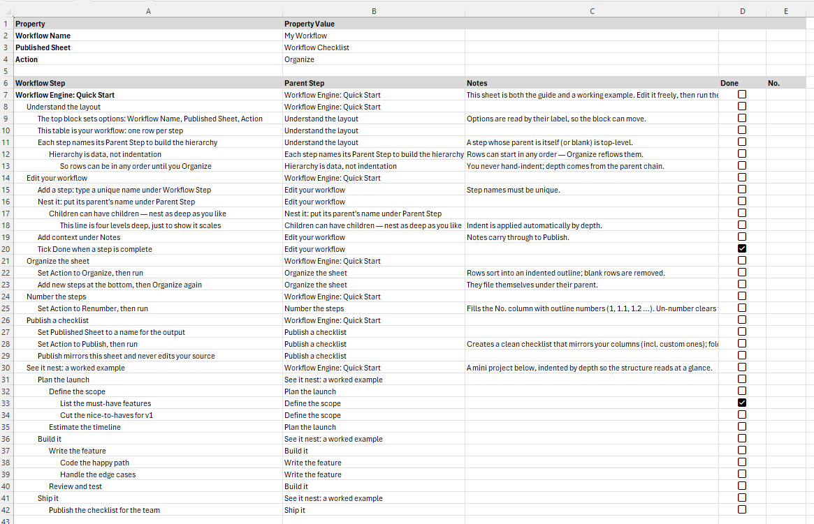

# ExcelScript Workflow Engine

Turn a plain worksheet into a structured, hierarchical workflow — then publish it
as a clean, shareable checklist. It's a single [Office Script](https://learn.microsoft.com/office/dev/scripts/)
(ExcelScript) — an Excel **Automate** script you run from the Automate tab in Excel for Microsoft 365.

*Run it on a blank sheet and it generates the self-documenting starter workflow above.*

## What it does

You describe a workflow as a flat table of steps, where each step names its **parent**.
The engine takes care of the structure:

- **Organize** — sorts the steps into a depth-first **indented outline** and removes
  blank rows. Everything (values, formatting, checkboxes) stays attached to its row.
  Add new steps anywhere, in any order, and Organize files them under their parent.
- **Renumber** — fills a `No.` column with hierarchical outline numbers (`1`, `1.1`,
  `1.2`, `2`, …) from the tree, so the sequence is always correct no matter how you edit.
  **Un-number** clears them. (Numbers live in their own column, never in the step name.)
  Add a `No.` column yourself first — same rules as any [custom column](#adding-your-own-columns);
  Renumber tells you if it's missing.
- **Publish** — compiles the workflow into a clean **checklist** on a separate sheet,
  mirroring your source's own formatting *and column layout*: columns appear in the order
  you authored them (the `Parent Step` column is dropped), so any [custom columns](#adding-your-own-columns)
  you added ride along too. It's re-created on every run, so your source sheet stays the
  single source of truth. If you have a `No.` column, its number is folded into the step
  label (`1.1 Step name`).
- **Starter scaffold** — run it on an empty sheet and it lays down a ready-to-use
  workflow that documents itself (pictured above).

## How the sheet is laid out

**Config block** (top) — `Property | Property Value` pairs, found by their label:

| Property | Meaning |
|---|---|
| `Workflow Name` | Title shown on the published checklist |
| `Published Sheet` | Name of the sheet **Publish** creates (becomes a clickable link once it exists) |
| `Action` | `Organize`, `Publish`, `Renumber`, or `Un-number` — an in-cell dropdown |
| `Linked Sheet` | Another sheet to keep step names unique against (repeatable — one row per sheet). The value becomes a clickable link to that sheet. |

**Working on a branch in its own sheet.** Add a `Linked Sheet` row (you can add several)
naming another sheet, and step-name uniqueness is enforced across all of them as one pool.
That lets you cut/paste a subtree onto a scaffolded sheet, work on it standalone, then
paste it back and **Organize** — names can't collide, so the branch re-files cleanly. The
link is per-sheet and one-directional, so add the row on each sheet you want checked from.
A `Linked Sheet` that doesn't exist (or has no step table) is reported as an error.

**Step table** — one row per step:

| Column | Meaning |
|---|---|
| `Workflow Step` | The step's name (must be unique) |
| `Parent Step` | The name of its parent; a step whose parent is itself or blank is top-level |
| `Notes` | Free text, carried through to Publish |
| `Done` | A checkbox |

The hierarchy lives in the **data** (parent pointers), not in indentation — so you can
type rows in any order and let **Organize** lay them out.

### Adding your own columns

You can add your own columns to the step table — `Assigned To`, `URL`, `Tags`, `Due`,
whatever you need. **Organize** moves them with their rows automatically (it doesn't
know or care what the extra columns are), as long as you follow the same layout rules
the built-in columns follow:

- **Give each column a header** — a non-empty header cell, formatted like the others.
  Organize finds the table by its run of headers, so a blank header cell ends the table.
- **No gaps** — put your columns immediately to the right of `Done`, with no empty
  column between them. The first empty header marks the end of the table; anything past
  it is treated as outside the table and won't move with the rows.
- **Leave an empty column to the right** — Organize borrows the first empty column past
  the table as temporary scratch space (it writes there and then clears it). Keep that
  one column clear so nothing of yours gets overwritten.
- **Don't park data on blank-step rows** — a row with an empty `Workflow Step` is treated
  as blank and deleted whole during Organize, taking any custom-column data on it with it.

> **Don't filter the step table while running Organize.** Organize reorders rows with
> Excel's native sort and then deletes blank rows by position — both assume every row is
> present. If a filter is hiding rows when you run it, clear the filter (Data → Clear /
> show all rows) first, then run, then re-apply the filter if you like. Reading and
> **Publish** are unaffected by filters; only Organize is.

## Running it

Add it as an Automate script and run it from inside Excel:

1. Open your workbook in Excel (desktop or [Excel for the web](https://www.office.com/launch/excel))
   with a Microsoft 365 **work/school** account — Office Scripts aren't available on personal accounts.
2. **Automate** → **New Script**, paste in [`workflow-engine.osts`](workflow-engine.osts), and **Run**.
3. On a blank sheet it writes the starter workflow. Otherwise it runs the `Action` you picked.

Set `Action` with the dropdown, run, and that's it. A successful run is silent;
problems are reported as an error message.

## How it works under the hood

- **One read, batched writes** — it reads the sheet once, works in memory, and writes
  back in batches to keep round-trips to the Excel service to a minimum.
- **Native sort for Organize** — rows are reordered with Excel's own sort (driven by a
  temporary rank column), so formatting and checkboxes travel with their rows.
- **Publish mirrors the source** — cells are copied (`copyFrom`), so the checklist
  inherits your fonts, colours, indentation, and checkboxes instead of imposing a look.
- **Unique step names** are enforced up front — they're the identity used to match each
  child to its parent.

## Companion: export to Word

A separate, optional add-in can export a workflow to a **Word document** — a clickable
Table of Contents, a heading per step (nested by depth), your `Notes` as the body, and
screenshots embedded inline via `![[image-name]]` references. It's a small Excel macro
that drives Word, kept entirely out of the core script (it's VBA and Windows-desktop-only,
the opposite of the Office Script). See [`word-export/`](word-export/) for the macro and
its own README.

## Credits

Vibe-coded with [Claude](https://claude.com/claude-code) (Anthropic) — designed and
built conversationally over many small iterations, entirely through Claude Code.

## License

[MIT](LICENSE)
